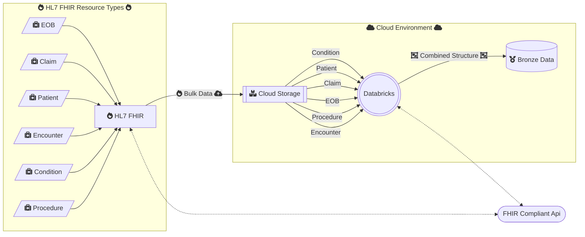

# Databricks On FHIR
## Introduction
This repo was setup to apply knowledge learned from the Databricks Certification using real health care scenarios and synthetic data available from multiple source (see "Source Data" section below).  The code in this repository will be far from perfect, and should not be utilized in a production setting.  It's a "learning" for applied learning.  That said, I'd love constructive and professional feedback both from a Databricks engineering perspective as well as content (HL7 FHIR) utilization.

## Disclaimers and Disclosuers
 - This repo is not assoicated or affiliated with Databricks or any FHIR organization
 - The code in here is not intended to be utilized in a production environment or any such purposes
 - Any clinical data display is sourced directly from the public sources disclosed below. To best our knowledge, the data is deidentified and/or synthesized for development and testing purposes.

## Purpose
To continue developing my Databricks, Python, Spark and FHIR skills by working on a real world use case that is meaningful and has potential to help improve healthcare through data.  My mission is to create a Databricks only (except for cloud storage) solution for ingesting HL7 FHIR data and then applying a medallion architecture to it using notebooks, worksflows and NL. As I continue to learn more about Databricks, I hope to revise, improve and extend the code here.

### This flowchart isn't comprehensive, but it does present the general idea of the problems being solved and where I'm currently at

## Source Data
[Smart Bulk Data Server](https://bulk-data.smarthealthit.org/)

## References
[Databricks Certification Program](https://www.databricks.com/resources/webinar/azure-databricks-free-training-series-track?scid=7018Y000001Fi0eQAC&utm_medium=paid+search&utm_source=google&utm_campaign=17882079543&utm_adgroup=140434566878&utm_content=od+webinar&utm_offer=azure-databricks-free-training-series-track&utm_ad=665885915712&utm_term=databricks%20academy&gad_source=1&gclid=Cj0KCQiAmNeqBhD4ARIsADsYfTdJ9kCiRL3UGKRz-PLUvdIQOa_QEDXP5Zw7tJav-lZcWlNFqSJ3YXIaAvPGEALw_wcB](https://www.databricks.com/learn/certification)https://www.databricks.com/learn/certification)

[Epic Open API](https://fhir.epic.com/)

[Smart On FHIR](https://smarthealthit.org/)

## Other Awesome Resources Used Here

[FontAwesome used in markdown](https://fontawesome.com/)

[Flowcharts used in markdown](https://mermaid.js.org/)https://mermaid.js.org/)

[Mermaid live editor](https://mermaid.live/)
