# DatabricksOnFHIR
## Introduction
This repo was setup to apply knowledge learned from the Databricks Certification using real health care scenarios and synthetic data.  The code in this repository will be far from perfect, and should not be utilized in a production setting.  It's a "learning" for applied learning.  That said, I'd love contructive and professional feedback both from a Databricks engineering perspective as well as content (HL7 FHIR) utilization.

## Source Data
[Smart Bulk Data Server](https://bulk-data.smarthealthit.org/)

```mermaid
graph LR
A[(Bronze Data)] -- Select Claims -->df[[Dataframe]] 
subgraph "Notebook Step 1 (Python)"
df --> B["💥Explode Array of Structs"]
B --> C(Encounter Struct)
B --> D(Claim Item Struct)
B --> E(Procedure Struct)
df --> F(("🧹Cleanse"))
D --> G(("🧹Cleanse"))
G --> H{{"🧩Restruct"}}
end
subgraph "Notebook Step 2 (Python)"
grp{Regroup}
agg{{Aggregate}}
grp --> agg
F --> grp
C --> I
E --> I
H --> I((Collect Sets))
I --> agg
end
write[(Silver Data)]
agg --> write
```

## References
[Databricks Certification Program](https://www.databricks.com/resources/webinar/azure-databricks-free-training-series-track?scid=7018Y000001Fi0eQAC&utm_medium=paid+search&utm_source=google&utm_campaign=17882079543&utm_adgroup=140434566878&utm_content=od+webinar&utm_offer=azure-databricks-free-training-series-track&utm_ad=665885915712&utm_term=databricks%20academy&gad_source=1&gclid=Cj0KCQiAmNeqBhD4ARIsADsYfTdJ9kCiRL3UGKRz-PLUvdIQOa_QEDXP5Zw7tJav-lZcWlNFqSJ3YXIaAvPGEALw_wcB](https://www.databricks.com/learn/certification)https://www.databricks.com/learn/certification)

[Epic Open API](https://fhir.epic.com/)

[Smart On FHIR](https://smarthealthit.org/)
